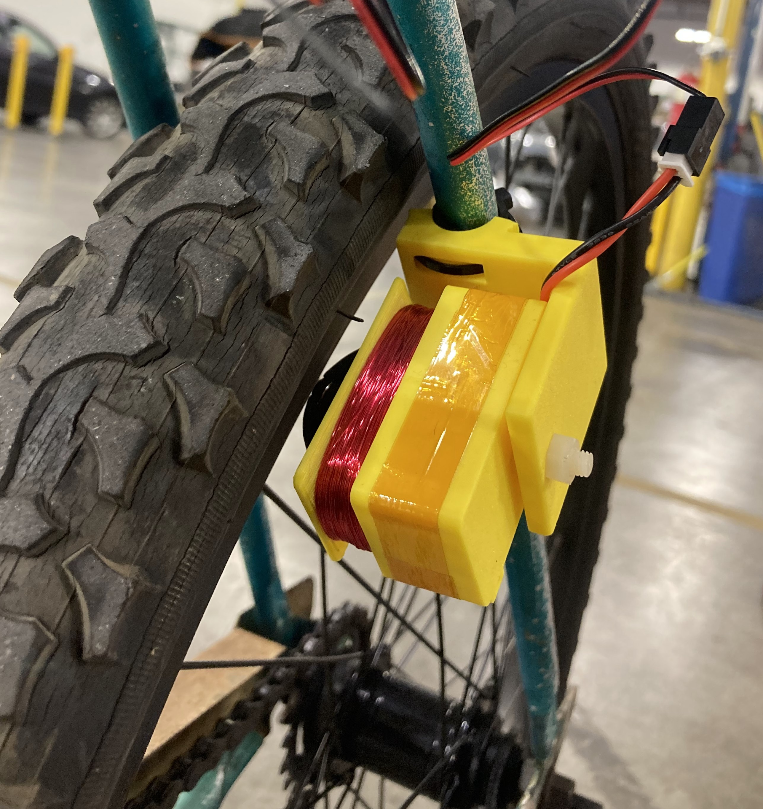
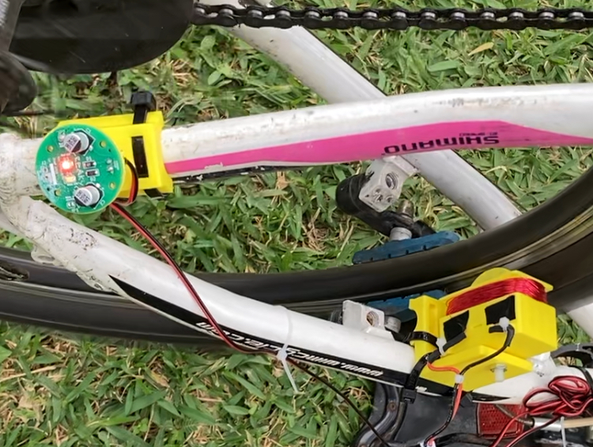
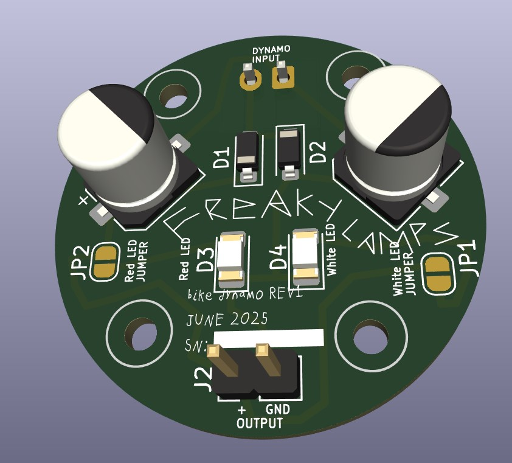
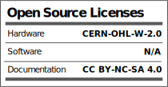

# Contactless Bicycle Dynamo using Eddy Currents

This is a small electrical generator that creates enough current to power a small bicycle light while your wheel is spinning. 

# Description

The design files here include the physical design files for the Dynamo and the LED light, as well as a custom PCB for the LED light which is a simple voltage rectifier doubler and choice of red or white led. 

If you would like to make this project:
- print off the files in:
  -  \Mechanical\Components\STLs\Final STL
- acquire parts in the 
- aquire tools in the 
- follow instructions in the 

This project started off with a desire to be a workshop I could host to show an interesting way to generate electricity and power a bike light without needing a battery. 

Here are the workshop slides:
https://docs.google.com/presentation/d/1txSlyZcSNcTIk4scu_-NPuIz-HN-7od_rSDEqWW2YtM/edit?usp=sharing

# Technical 

## Physical Design Files
The parts are labelled as follows:

- P001-B100	-	Square Dynamo
- P001-B101	-	Dynamo Cover
- P001-B102	-	Magnet Holder Ring
- P001-B103	-	M5 Bearing Adaptor
- P001-B104	-	Fork Bracket
- P001-B105	-	PCB Cover
- P001-B106	-	LED Light Mount

There is also an assembly of the Dynamo labelled:

- P001-B001	-	Dynamo
## PCB Design files

The PCB contains red and white LEDs which can be selected by doing a solder bridge while assembling. 

You can't use both at the same time. If you solder both, only the Red LED will light (it has a lower forward voltage). 

The LED PCB design can be found in:
- \Electrical\Dyno_LED_PCB

# Acknowledgments

Thank you to:
Lucas Ray, Clara Caspard, and YJ Rodrigues for helping develop this! 

# License
This is an open source project!

